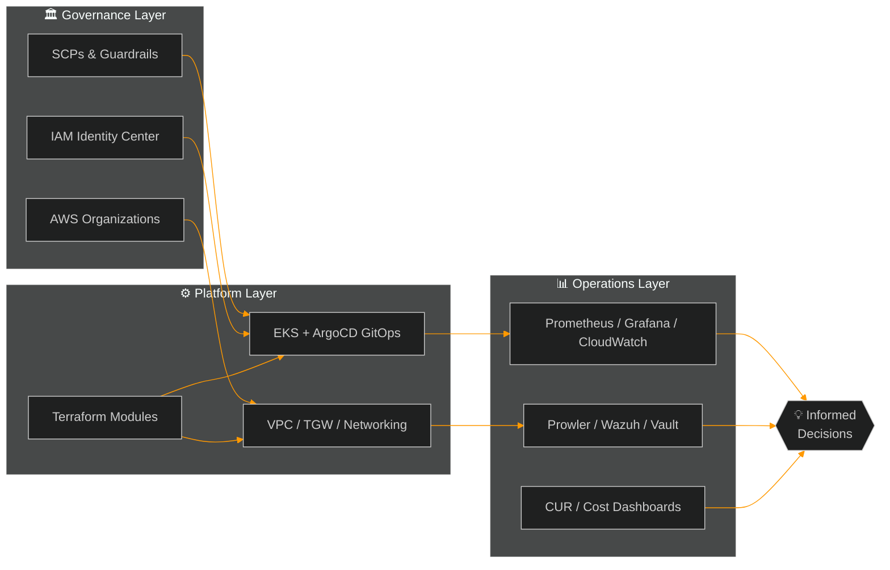

<!-- ═══════════════════════════════════════════════════════════════ -->
<!--  HERO — Animated wave banner (capsule-render)                    -->
<!-- ═══════════════════════════════════════════════════════════════ -->

<div align="center">


<!-- Typing animation — one focused element, AWS orange -->
<a href="https://git.io/typing-svg">
  
</a>

<br/><br/>

<!-- Contact row — 4 badges max, all functional -->
<a href="https://www.linkedin.com/in/armandofcom/"></a>
<a href="https://www.syscu.es/"></a>
<a href="https://www.credly.com/users/armandofcom/badges"></a>
<a href="mailto:armandof@armandof.com"></a>

<br/><br/>


</div>

<br/>

<!-- ═══════════════════════════════════════════════════════════════ -->
<!--  ABOUT                                                           -->
<!-- ═══════════════════════════════════════════════════════════════ -->

## 🧑‍🚀 whoami

```hcl
resource "human" "armando" {
  role       = "Cloud Architect"
  location   = "Madrid, Spain 🇪🇸"
  origin     = "Linux / UNIX SysAdmin — I know what 3 AM on-call feels like"

  domains    = ["AWS", "DevSecOps", "SRE", "FinOps", "Platform Engineering"]

  builds = [
    "Multi-account AWS landing zones with governance baked in",
    "Reusable Terraform / OpenTofu modules teams can actually maintain",
    "EKS / ECS platforms with real observability, not just dashboards",
    "CI/CD pipelines that are fast, secure and repeatable",
    "FinOps visibility so AWS doesn't bill you for your thoughts",
  ]

  community  = ["Founder @ SysAdminsdeCuba", "Founder @ SysCu"]

  philosophy = "Automate everything you repeat twice."
}
```

<br/>

<!-- ═══════════════════════════════════════════════════════════════ -->
<!--  ARCHITECTURE — a Cloud Architect shows, not tells               -->
<!--  Mermaid renders natively on GitHub                              -->
<!-- ═══════════════════════════════════════════════════════════════ -->

## 🏗️ How I think — a reference architecture



> **Security by design. Observability by default. Cost-awareness always.**

<br/>

<!-- ═══════════════════════════════════════════════════════════════ -->
<!--  WHAT I DO                                                       -->
<!-- ═══════════════════════════════════════════════════════════════ -->

## 🧭 What I do

<table>
  <tr>
    <td width="33%" align="center">
      <h3>☁️</h3>
      <b>Cloud Architecture</b>
      <p align="left">Multi-account AWS, landing zones, networking, IAM, security baselines and production-ready designs that scale.</p>
    </td>
    <td width="33%" align="center">
      <h3>🧱</h3>
      <b>Infrastructure as Code</b>
      <p align="left">Terraform / OpenTofu modules, GitOps workflows, environment promotion and automated delivery.</p>
    </td>
    <td width="33%" align="center">
      <h3>🐳</h3>
      <b>Kubernetes & Containers</b>
      <p align="left">EKS, ECS Fargate, Helm, ArgoCD, autoscaling, ingress and operational best practices.</p>
    </td>
  </tr>
  <tr>
    <td width="33%" align="center">
      <h3>🔐</h3>
      <b>DevSecOps</b>
      <p align="left">Security from the design phase: secrets, scanning, compliance, auditability, controlled pipelines.</p>
    </td>
    <td width="33%" align="center">
      <h3>📊</h3>
      <b>Observability & SRE</b>
      <p align="left">Metrics, logs, traces, SLOs, alerting and systems you can understand under pressure.</p>
    </td>
    <td width="33%" align="center">
      <h3>💸</h3>
      <b>FinOps</b>
      <p align="left">Cost allocation, tagging strategies, rightsizing and making spend visible to engineering & business.</p>
    </td>
  </tr>
</table>

<br/>

<!-- ═══════════════════════════════════════════════════════════════ -->
<!--  TECH STACK — skill-icons: modern, clean, no badge walls         -->
<!-- ═══════════════════════════════════════════════════════════════ -->

## 🛠️ Tech Stack

<div align="center">

### ☁️ Cloud & Platform


### 🧱 IaC & Automation


### 🐳 Containers & GitOps


### 🔐 Security & Observability


### 🗄️ Data & CI/CD


</div>

<details>
<summary><b>📌 Full engineering map (click to expand)</b></summary>
<br/>

```txt
Cloud Architecture     AWS (core), GCP, Azure, Apigee X, Cloudflare
AWS Services           VPC · IAM · Organizations · RDS/Aurora · ECS · EKS · Lambda · S3 · CloudFront · Route 53
Containers             Docker · EKS · ECS Fargate · Helm · ArgoCD · OpenShift
IaC                    Terraform · OpenTofu · CloudFormation · Ansible
DevSecOps              Prowler · SonarCloud · Wazuh · OpenVAS · Vault · Consul · PKI
Observability          CloudWatch · Prometheus · Grafana · OpenSearch · Sentry
FinOps                 Cost Explorer · CUR / Data Exports · Tagging · Dashboards · Rightsizing
Databases              PostgreSQL · Aurora · MySQL · MongoDB · Redis
CI/CD                  GitHub Actions · GitLab CI · Bitbucket Pipelines · Jenkins
Languages              Bash · Python · Go · HCL · YAML (unfortunately fluent)
```

</details>

<br/>

<!-- ═══════════════════════════════════════════════════════════════ -->
<!--  CURRENT FOCUS                                                   -->
<!-- ═══════════════════════════════════════════════════════════════ -->

## 🚀 Current focus

- 🏛️ Designing **secure multi-account AWS architectures** for real production environments
- 🧩 Building reusable **Terraform/OpenTofu modules** and automation patterns
- ☸️ Running **EKS/ECS workloads** with observability and reliability built-in
- 🤖 Applying **AI to operations**: automation, documentation and cloud workflows
- 📉 Creating **FinOps dashboards** and cost optimization strategies
- 🌱 Growing **[SysCu](https://www.syscu.es/)** — cloud, FinOps, observability & automation

<br/>

<!-- ═══════════════════════════════════════════════════════════════ -->
<!--  GITHUB ANALYTICS — one clean unified block                      -->
<!-- ═══════════════════════════════════════════════════════════════ -->

## 📊 GitHub Analytics

<div align="center">


<br/><br/>


<br/><br/>


<br/><br/>

<!-- 🐍 Contribution Snake — requires the GitHub Action (see snake.yml) -->
<picture>
  <source media="(prefers-color-scheme: dark)" srcset="https://raw.githubusercontent.com/armandofcom/armandofcom/output/github-contribution-grid-snake-dark.svg"/>
  <source media="(prefers-color-scheme: light)" srcset="https://raw.githubusercontent.com/armandofcom/armandofcom/output/github-contribution-grid-snake.svg"/>
  
</picture>

</div>

<br/>

<!-- ═══════════════════════════════════════════════════════════════ -->
<!--  CERTIFICATIONS                                                  -->
<!-- ═══════════════════════════════════════════════════════════════ -->

## 🏅 Certifications & Learning

<div align="center">

<a href="https://www.credly.com/users/armandofcom/badges"></a>
<a href="https://www.credly.com/users/armandofcom/badges"></a>
<a href="https://www.credly.com/users/armandofcom/badges"></a>
<a href="https://www.credly.com/users/armandofcom/badges"></a>

<sub>👉 All verified badges on <a href="https://www.credly.com/users/armandofcom/badges">Credly</a></sub>

</div>

<br/>

<!-- ═══════════════════════════════════════════════════════════════ -->
<!--  COMMUNITY & COLLABORATION                                       -->
<!-- ═══════════════════════════════════════════════════════════════ -->

## 🌍 Community

- 🇨🇺 Founder of **SysAdminsdeCuba** — systems, Linux, DevOps and cloud knowledge community
- 🚀 Founder of **[SysCu](https://www.syscu.es/)** — cloud, automation, FinOps, observability & AI applied to operations
- 🇪🇸 Active in AWS, DevOps, SRE and automation communities in Spain

## 🤝 Let's collaborate on

<div align="center">

| ☁️ Cloud Migration | 🔐 DevSecOps | 💸 FinOps |
|:---:|:---:|:---:|
| Architecture, security and cost control from day one | Secure pipelines & workloads from the design phase | Understand, allocate and optimize cloud spend |
| **📊 Observability** | **🐳 Kubernetes** | **🧱 IaC** |
| Metrics, logs and alerts that actually help | EKS, Helm, GitOps & operational excellence | Reusable modules & repeatable delivery |

</div>

<br/>

<!-- ═══════════════════════════════════════════════════════════════ -->
<!--  FOOTER                                                          -->
<!-- ═══════════════════════════════════════════════════════════════ -->

<div align="center">

```txt
SysAdmin de alma.
Cloud Architect de profesión.
DevSecOps por responsabilidad.
SRE porque producción no perdona.
FinOps para que AWS no te cobre hasta los pensamientos.
```

<br/>

<a href="https://www.linkedin.com/in/armandofcom/"></a>
<a href="https://github.com/armandofcom"></a>
<a href="https://www.syscu.es/"></a>
<a href="mailto:armandof@armandof.com"></a>


</div>